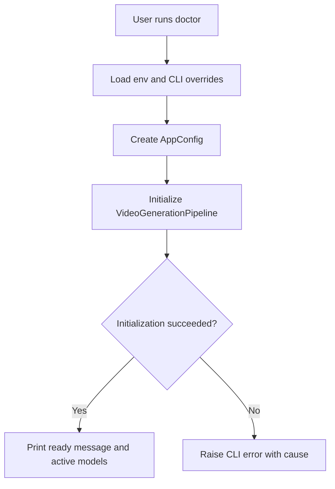

# doctor Command

`doctor` verifies local readiness and prints active runtime configuration.

## What this command does

This command performs environment and configuration validation without creating media output:

1. Loads environment and CLI model overrides.
2. Constructs app configuration.
3. Initializes the pipeline to validate prerequisites.
4. Prints success and active models if validation passes.

## When to use it

Use `doctor` before running long commands to detect setup issues early, especially after changing dependencies, tokens, model names, or environment variables.

## Required and Optional Inputs

- Optional:
  - `--work-dir TEXT`

No required positional or option inputs beyond standard global flags.

## Mechanism Flow



## Practical Examples

Basic check:

```bash
content-creator doctor
```

Check with explicit model overrides:

```bash
content-creator \
  -L mistralai/Mixtral-8x7B-Instruct-v0.1 \
  -S openai/whisper-large-v3 \
  -T espnet/kan-bayashi_ljspeech_vits \
  -I stabilityai/stable-diffusion-xl-base-1.0 \
  doctor
```

Check with debug traces enabled:

```bash
content-creator --debug doctor
```

## Failure Modes to Expect

- Missing environment variables (for example token requirements).
- Invalid model identifiers.
- Missing local runtime prerequisites such as ffmpeg tools.

When `--debug` is enabled, failures include full traceback context.
