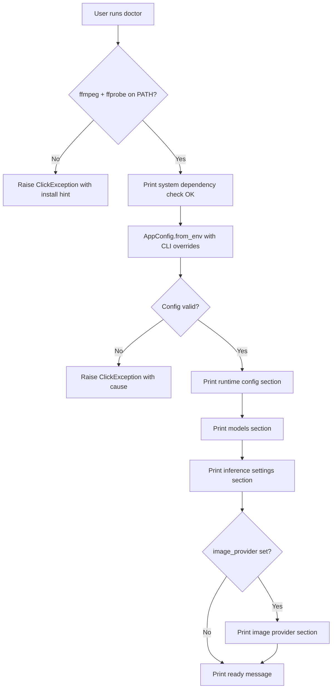

# doctor Command

`doctor` verifies local readiness and prints active runtime configuration.

## What this command does

This command performs environment and configuration validation without creating media output:

1. Checks that `ffmpeg` and `ffprobe` are available on `PATH`.
2. Validates `HF_TOKEN` and any model or inference overrides via environment variables.
3. Constructs the full `AppConfig` (all models, tuning profile, inference settings).
4. Prints a structured summary of every active configuration value.

It does **not** make any network calls or load model weights — it is safe and fast to run at any time.

## When to use it

Run `doctor` before starting a long pipeline job to catch setup problems early — especially after:

- Installing or updating the package for the first time.
- Changing model identifiers or switching tuning profiles.
- Rotating `HF_TOKEN` or adding an image provider key.
- Moving to a new machine or virtual environment.

## Required and Optional Inputs

- Optional:
  - `--work-dir TEXT`

No required positional or option inputs beyond standard global flags.

## Checks performed

| Check | Failure cause |
|---|---|
| `ffmpeg` on `PATH` | Not installed or not in shell `PATH` |
| `ffprobe` on `PATH` | Not installed or not in shell `PATH` |
| `HF_TOKEN` present | Variable unset or empty |
| Model identifiers valid | Malformed or unrecognized identifier strings |
| Tuning profile valid | `HF_TUNING_PROFILE` set to an unknown value |
| Image composition mode valid | `HF_IMAGE_COMPOSITION_MODE` set to an unknown value |
| Inference numeric overrides valid | Non-numeric or out-of-range env var values |

## Output sections

A successful run prints four labelled sections:

### Runtime configuration

```
── Runtime configuration ──────────────────────────
📁 Work directory:             ./output
🎛️ Tuning profile:             balanced
🖼️ Image composition mode:     balanced
🧩 Preclassification ensemble: enabled
```

### Models

```
── Models ──────────────────────────────────────────
🧠 LLM:                        meta-llama/Llama-3.3-70B-Instruct
🎧 STT:                        openai/whisper-large-v3
🔊 TTS:                        hexgrad/Kokoro-82M
🖼️ Image:                      black-forest-labs/FLUX.1-dev
🛡️ Safety (primary):           cardiffnlp/twitter-roberta-base-offensive
🛡️ Safety (secondary):         unitary/unbiased-toxic-roberta
🎙️ Diarization:                pyannote/speaker-diarization-3.1
💬 Preclassification emotion:  j-hartmann/emotion-english-distilroberta-base
🎯 Preclassification intent:   MoritzLaurer/deberta-v3-large-zeroshot-v2.0
```

### Inference settings

```
── Inference settings ──────────────────────────────
🧠 LLM:   max_tokens=900, temperature=0.6, top_p=1.0
🖼️ Image: steps=28, guidance_scale=3.5, seed=None
🛡️ Safety top_k: None
```

### Image provider override (only when `HF_INFERENCE_PROVIDER` is set)

```
── Image provider override ─────────────────────────
🌐 Provider: fal-ai
🔑 Provider key: set
```

## Mechanism Flow


```mermaid
flowchart TD
    A[User runs doctor] --> B{ffmpeg + ffprobe on PATH?}
    B -->|No| C[Raise ClickException with install hint]
    B -->|Yes| D[Print system dependency check OK]
    D --> E[AppConfig.from_env with CLI overrides]
    E --> F{Config valid?}
    F -->|No| G[Raise ClickException with cause]
    F -->|Yes| H[Print runtime config section]
    H --> I[Print models section]
    I --> J[Print inference settings section]
    J --> K{image_provider set?}
    K -->|Yes| L[Print image provider section]
    K -->|No| M[Print ready message]
    L --> M
```

## Practical Examples

Basic check:

```bash
content-creator doctor
```

Check with explicit model overrides:

```bash
content-creator \
  -L mistralai/Mixtral-8x7B-Instruct-v0.1 \
  -S openai/whisper-large-v3 \
  -T espnet/kan-bayashi_ljspeech_vits \
  -I stabilityai/stable-diffusion-xl-base-1.0 \
  doctor
```

Check with a non-default tuning profile:

```bash
HF_TUNING_PROFILE=cinematic content-creator doctor
```

Check with a third-party image provider configured:

```bash
HF_INFERENCE_PROVIDER=fal-ai HF_PROVIDER_KEY=fal-... content-creator doctor
```

Check with debug traces enabled:

```bash
content-creator --debug doctor
```

## Failure Modes to Expect

- **`ffmpeg` or `ffprobe` not found** — install ffmpeg via your system package manager.
  - macOS: `brew install ffmpeg`
  - Debian/Ubuntu: `sudo apt install ffmpeg`
- **`HF_TOKEN` missing** — set the variable in your shell or `.envrc` file.
- **Invalid tuning profile** — `HF_TUNING_PROFILE` must be one of: `balanced`, `cinematic`, `consistent`, `fast`.
- **Invalid image composition mode** — `HF_IMAGE_COMPOSITION_MODE` must be one of: `balanced`, `dynamic`, `portrait`, `establishing`.
- **Malformed numeric env var** — check `HF_LLM_MAX_TOKENS`, `HF_LLM_TEMPERATURE`, `HF_IMAGE_NUM_INFERENCE_STEPS`, etc. for typos.

When `--debug` is enabled, failures include full traceback context.

## Getting Started Checklist

If `doctor` fails, work through this list top to bottom:

1. **Install ffmpeg** if the system dependency check fails.
2. **Set `HF_TOKEN`** — obtain a token at <https://huggingface.co/settings/tokens>.
3. **Accept model gating agreements** for any gated models (pyannote diarization requires accepting terms on the Hugging Face model page).
4. **Verify env vars** — run `env | grep HF_` to see what is currently exported.
5. Re-run `content-creator doctor` until all checks pass before using `from-audio` or `from-text`.
