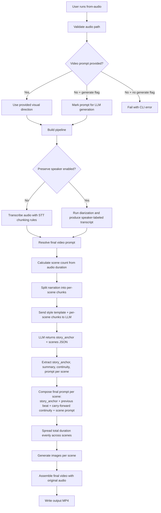

# from-audio Command

`from-audio` generates a complete video starting from an existing audio track.

## What this command does

This command performs an end-to-end workflow:

1. Accepts an input audio file.
2. Transcribes the audio into text (chunked STT by default).
3. Resolves visual direction from either:
   - `--video-prompt`, or
   - `--generate-video-prompt` (LLM-generated from transcript).
4. Plans scenes from transcript content and visual direction.
5. Generates scene images.
6. Assembles final video using the original audio.

## When to use it

Use `from-audio` when you already have narration audio and want matching visuals.

## Required and Optional Inputs

- Required:
  - `--audio-file FILE`
  - `--output FILE`
- One visual-direction choice is required:
  - `--video-prompt TEXT`, or
  - `--generate-video-prompt`
- Optional:
  - `--chunk-seconds FLOAT` (default `45.0`; set to `0` to disable chunking)
  - `--preserve-speaker / --no-preserve-speaker` (default `--no-preserve-speaker`)
  - `--work-dir TEXT`

## STT and diarization behavior

- Default mode uses STT with optional chunking (`--chunk-seconds`).
- If `--preserve-speaker` is enabled, diarization is used so transcript lines are speaker-labeled.
- Speaker-preserving mode requires diarization dependencies and model access.

## Mechanism Flow



## Practical Examples

Prompt provided directly:

```bash
content-creator from-audio \
  --audio-file ./assets/voiceover.mp3 \
  --video-prompt "clean futuristic datacenter, cinematic camera movement, realistic light" \
  --chunk-seconds 45 \
  --output ./output/datacenter.mp4
```

Prompt generated from transcript:

```bash
content-creator from-audio \
  --audio-file ./assets/voiceover.mp3 \
  --generate-video-prompt \
  --output ./output/generated-style-from-audio.mp4
```

Speaker-preserving transcript mode:

```bash
content-creator from-audio \
  --audio-file ./assets/interview.wav \
  --generate-video-prompt \
  --preserve-speaker \
  --chunk-seconds 0 \
  --output ./output/interview.mp4
```

## Failure Modes to Expect

- Missing both `--video-prompt` and `--generate-video-prompt`: command fails early.
- Invalid audio path: command fails before pipeline execution.
- Diarization requirements not satisfied with `--preserve-speaker`: runtime error with setup details.
- Missing token, model permissions, or ffmpeg tools: startup or pipeline failure.
