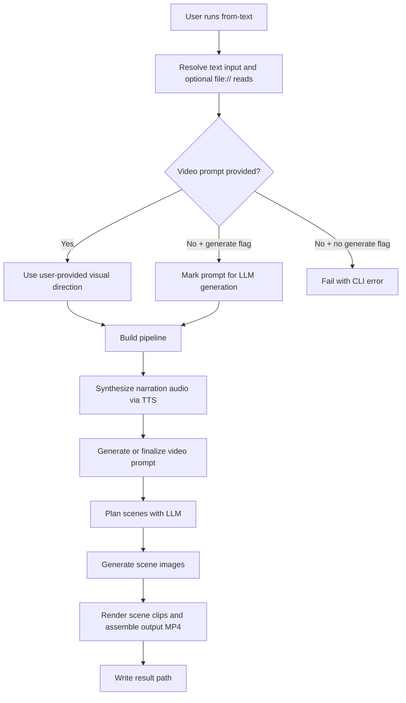

# from-text Command

`from-text` generates a complete video starting from narration text.

## What this command does

This command performs an end-to-end workflow:

1. Reads narration text.
2. Resolves visual direction from either:
   - `--video-prompt`, or
   - `--generate-video-prompt` (LLM-generated from narration).
3. Synthesizes narration audio with TTS.
4. Plans scene prompts with the planner.
5. Generates scene images.
6. Assembles the final MP4 with ffmpeg-based rendering.

## When to use it

Use `from-text` when you have script text and want the tool to generate both audio and visuals.

## Required and Optional Inputs

- Required:
  - `--text-transcription TEXT`
  - `--output FILE`
- One of the following visual-direction choices is required:
  - `--video-prompt TEXT`, or
  - `--generate-video-prompt`
- Optional:
  - `--image-workers INTEGER` (default `HF_IMAGE_WORKERS` or `1`)
  - `--work-dir TEXT`
  - `--view-preclassification / --no-view-preclassification` (default `--no-view-preclassification`)

## Important Input Detail: `file://` text references

`--text-transcription` and `--video-prompt` support `file://` URIs.

Examples:

- Relative: `file://prompts/script.txt`
- Absolute: `file:///Users/name/prompts/script.txt`

The CLI loads and validates the file contents before running the pipeline.

## Worker and analysis behavior

- `--image-workers` controls parallel scene image generation. If omitted, the command falls back to `HF_IMAGE_WORKERS`, then `1`.
- `--view-preclassification` prints the planner's video-prompt preclassification block after LLM analysis so you can inspect mood, tone, and safety-related metadata before reviewing `manifest.json`.

## Mechanism Flow



## Practical Examples

Use explicit visual direction:

```bash
content-creator from-text \
  --text-transcription "A short narration about ocean currents" \
  --video-prompt "cinematic ocean documentary, natural light, high detail" \
  --output ./output/ocean.mp4
```

Generate visual direction automatically:

```bash
content-creator from-text \
  --text-transcription file://prompts/narration.txt \
  --generate-video-prompt \
  --output ./output/generated-style.mp4
```

Use two image workers and print preclassification details:

```bash
content-creator from-text \
  --text-transcription file://prompts/narration.txt \
  --generate-video-prompt \
  --image-workers 2 \
  --view-preclassification \
  --output ./output/generated-style.mp4
```

## Failure Modes to Expect

- Missing both `--video-prompt` and `--generate-video-prompt`: command fails early.
- Empty or unreadable `file://` path: command fails with a path-specific error.
- Missing `HF_TOKEN`, model access, or ffmpeg dependencies: pipeline setup or execution fails.
