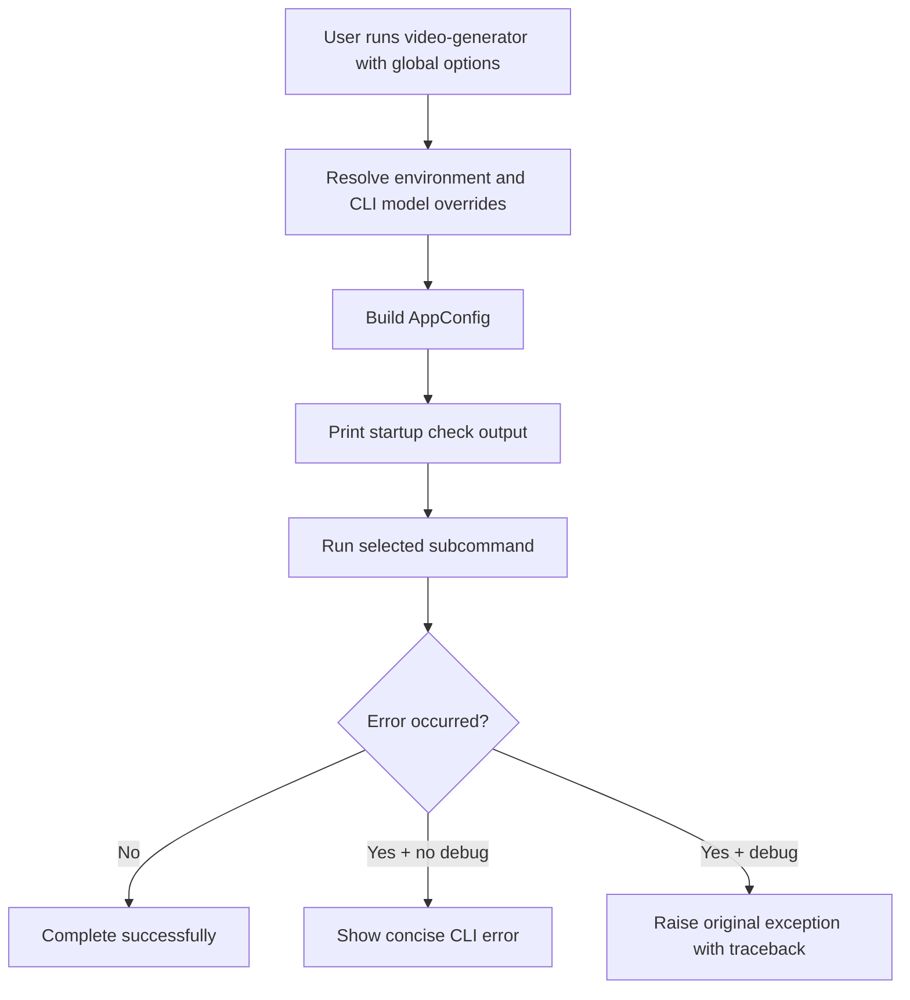

# Global CLI Options

Global options are specified before the command name. They apply to all commands.

Example:

```bash
video-generator --debug --llm-model mistralai/Mixtral-8x7B-Instruct-v0.1 from-text ...
```

## Option Reference

### `--debug / --no-debug`

- Default: `--no-debug`
- Enables verbose runtime behavior and full tracebacks on failure.
- Practical effect:
  - In normal mode, unexpected exceptions are converted into a concise CLI error.
  - In debug mode, the original exception is raised, which is useful when diagnosing stack traces.

### `-L, --llm-model TEXT`

- Overrides the LLM model used for scene planning and optional video prompt generation.
- Takes precedence over environment configuration.

### `-S, --stt-model TEXT`

- Overrides the speech-to-text model used for transcription.
- Relevant for `from-audio` and `transcribe`.

### `-T, --tts-model TEXT`

- Overrides the text-to-speech model used to synthesize narration.
- Relevant for `from-text`.

### `-I, --image-model TEXT`

- Overrides the image generation model used for scene visuals.
- Relevant for `from-text` and `from-audio`.

## Startup Behavior

For commands that build a pipeline (`from-text`, `from-audio`, `transcribe`), the CLI performs startup checks and prints active model and work directory information.



## Common Patterns

Use global overrides to test models without editing environment files:

```bash
video-generator \
  -L mistralai/Mixtral-8x7B-Instruct-v0.1 \
  -S openai/whisper-large-v3 \
  -T espnet/kan-bayashi_ljspeech_vits \
  -I stabilityai/stable-diffusion-xl-base-1.0 \
  doctor
```
