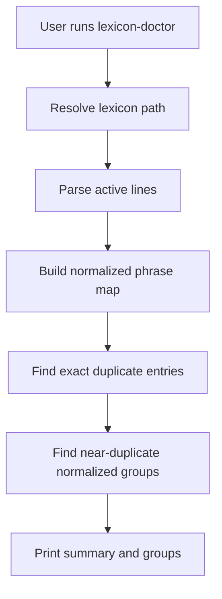

# lexicon-doctor Command

`lexicon-doctor` audits profanity lexicon quality and reports duplicate entries.

## What this command does

This command validates a profanity lexicon file and prints quality diagnostics:

1. Resolves the lexicon path (default: bundled `data/profanity_words.txt`).
2. Counts total lines and active entries (ignoring blanks/comments).
3. Detects exact duplicates (case-insensitive, whitespace-trimmed).
4. Detects near-duplicate groups that normalize to the same phrase.

## Required and Optional Inputs

- Optional:
  - `--profanity-words-file FILE`
  - `--max-groups INTEGER` (default `20`)

## Mechanism Flow



## Practical Examples

Audit bundled default list:

```bash
content-creator lexicon-doctor
```

Audit a custom file:

```bash
content-creator lexicon-doctor \
  --profanity-words-file ./config/policy-profanity.txt
```

Limit near-duplicate group output:

```bash
content-creator lexicon-doctor --max-groups 10
```
