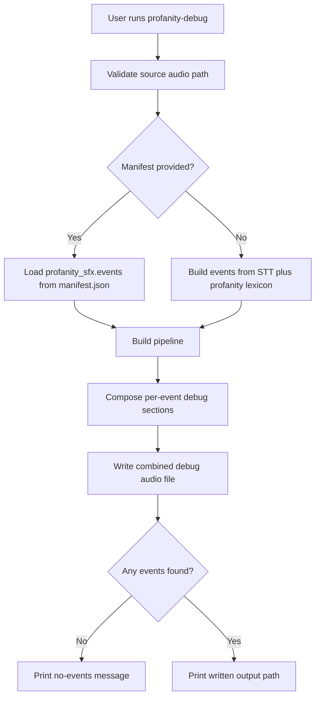

# profanity-debug Command

`profanity-debug` renders a debug audio artifact that makes profanity replacement behavior easy to inspect.

## What this command does

This command builds a reviewable audio file around profanity replacement events:

1. Reads the source audio file.
2. Either loads existing profanity events from `--manifest`, or recomputes them from STT plus the profanity lexicon.
3. For each event, inserts a spoken announcement with the detected word and timing.
4. Appends the original audio snippet, a spoken marker, and the exact bleep segment the profanity filter would overlay.
5. Writes a single debug audio file for manual QA.

## When to use it

Use `profanity-debug` when tuning profanity lexicons, sound packs, timing padding, or when auditing an existing `manifest.json` without regenerating a full video.

## Required and Optional Inputs

- Required:
  - `--audio-file FILE`
  - `--output FILE`
- Optional:
  - `--manifest FILE` (loads `profanity_sfx.events` from an existing `manifest.json`)
  - `--profanity-words-file FILE` (ignored when `--manifest` is provided)
  - `--profanity-sound-pack-dir DIR` (ignored when `--manifest` is provided)
  - `--profanity-pad-ms INTEGER` (default `80`; ignored when `--manifest` is provided)
  - `--context-seconds FLOAT` (default `0.5`)
  - `--gap-seconds FLOAT` (default `0.3`)
  - `--work-dir TEXT`

## Manifest behavior

- When `--manifest` is provided, the command reuses `profanity_sfx.events` from that file instead of rerunning transcription and profanity detection.
- If the manifest includes `video_prompt_preclassification`, that metadata is passed through so the debug artifact preserves context.
- If the manifest includes `narration_text`, it is reused as transcript context for the debug build.
- When `--manifest` is not provided, the command uses the configured STT model, profanity lexicon, and sound pack to discover events from scratch.

## Mechanism Flow



## Practical Examples

Generate debug audio from live profanity detection:

```bash
content-creator profanity-debug \
  --audio-file ./assets/interview.wav \
  --output ./output/interview-profanity-debug.m4a
```

Reuse an existing manifest from a prior run:

```bash
content-creator profanity-debug \
  --audio-file ./assets/interview.wav \
  --manifest ./output/cleaned/manifest.json \
  --output ./output/interview-profanity-debug.m4a
```

Tune context and spacing around each event:

```bash
content-creator profanity-debug \
  --audio-file ./assets/interview.wav \
  --output ./output/interview-profanity-debug.m4a \
  --profanity-pad-ms 125 \
  --context-seconds 0.75 \
  --gap-seconds 0.4
```

## Failure Modes to Expect

- Invalid audio path: command fails immediately.
- Invalid or malformed manifest structure: command fails with a manifest-specific CLI error.
- Missing token, model permissions, or ffmpeg dependencies when event detection must be recomputed: runtime failure during pipeline execution.