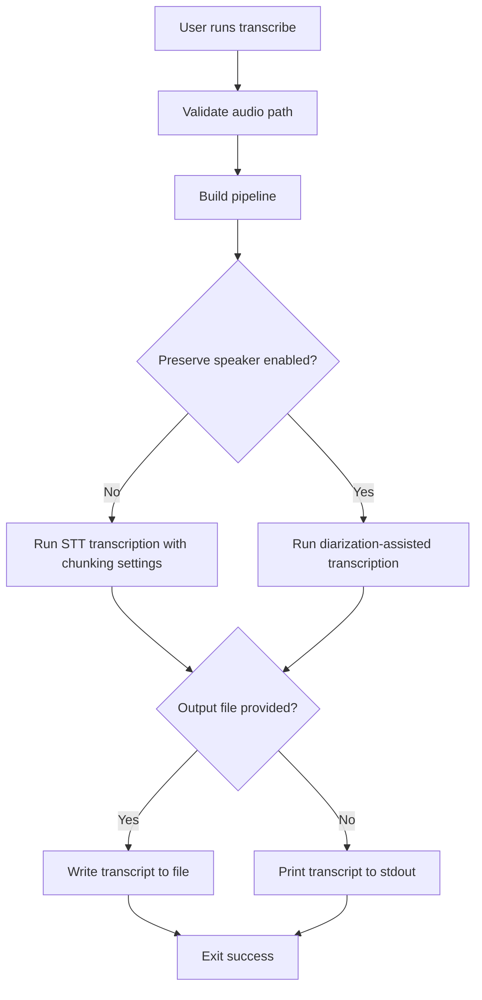

# transcribe Command

`transcribe` extracts text from an audio file without generating a video.

## What this command does

This command is focused on transcript generation:

1. Reads an audio file.
2. Transcribes with STT.
3. Optionally applies chunked STT for long audio.
4. Optionally preserves speaker labels using diarization.
5. Writes transcript to a file or prints to stdout.

## When to use it

Use `transcribe` when you only need transcript output, such as preparing script text or validating STT quality before video generation.

## Required and Optional Inputs

- Required:
  - `--audio-file FILE`
- Optional:
  - `--output FILE` (if omitted, transcript prints to terminal)
  - `--chunk-seconds FLOAT` (default `45.0`; set to `0` to disable chunking)
  - `--preserve-speaker / --no-preserve-speaker` (default `--no-preserve-speaker`)
  - `--work-dir TEXT`

## Output behavior

- With `--output`, transcript is written to the file and a success message is printed.
- Without `--output`, transcript text is emitted directly to stdout.

## Mechanism Flow



## Practical Examples

Write transcript to file:

```bash
video-generator transcribe \
  --audio-file ./assets/meeting.m4a \
  --chunk-seconds 45 \
  --output ./output/meeting.txt
```

Print transcript directly:

```bash
video-generator transcribe \
  --audio-file ./assets/meeting.m4a \
  --chunk-seconds 0
```

Use speaker labeling:

```bash
video-generator transcribe \
  --audio-file ./assets/interview.wav \
  --preserve-speaker \
  --output ./output/interview-speakers.txt
```

## Failure Modes to Expect

- Invalid audio path: command fails immediately.
- Diarization setup missing when `--preserve-speaker` is enabled: runtime error.
- STT model permission or token issues: transcription request failure.
