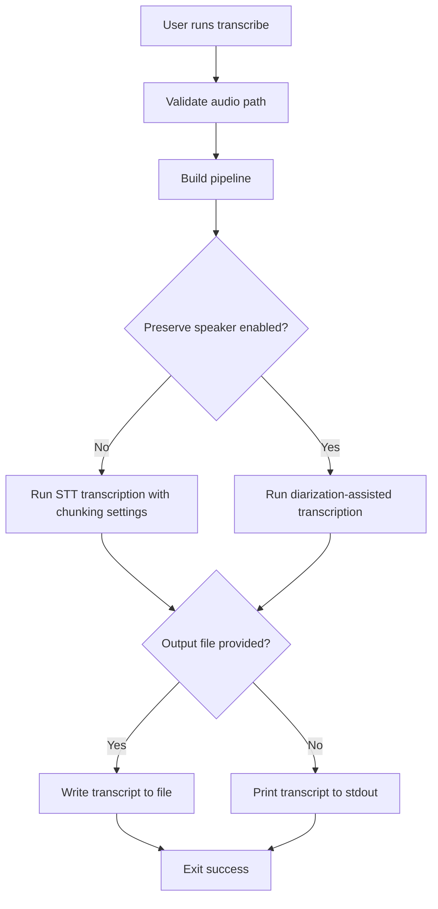

# transcribe Command

`transcribe` extracts text from an audio file without generating a video.

## What this command does

This command is focused on transcript generation:

1. Reads an audio file.
2. Transcribes with STT.
3. Optionally applies chunked STT for long audio.
4. Optionally preserves speaker labels using diarization.
5. In speaker mode, if one speaker dominates ~90%+ of diarized duration, sparse secondary labels are automatically collapsed into the primary speaker.
6. Writes transcript to a file or prints to stdout.

## When to use it

Use `transcribe` when you only need transcript output, such as preparing script text or validating STT quality before video generation.

## Required and Optional Inputs

- Required:
  - `--audio-file FILE`
- Optional:
  - `--output FILE` (if omitted, transcript prints to terminal)
  - `--chunk-seconds FLOAT` (default `45.0`; set to `0` to disable chunking)
  - `--transcribe-workers INTEGER` (default `HF_TRANSCRIBE_WORKERS` or `1`)
  - `--preserve-speaker / --no-preserve-speaker` (default `--no-preserve-speaker`)
  - `--speaker-count INTEGER` (force diarization to an exact speaker count)
  - `--min-speakers INTEGER` (minimum speaker count bound for diarization)
  - `--max-speakers INTEGER` (maximum speaker count bound for diarization)
  - `--speaker-dominance-threshold FLOAT` (default `HF_SPEAKER_DOMINANCE_THRESHOLD` or `0.9`; only used when auto-collapse is active)
  - `--content-safety / --no-content-safety` (default `--no-content-safety`)
  - `--content-safety-filter / --no-content-safety-filter` (default `--no-content-safety-filter`)
  - `--content-safety-threshold FLOAT` (default `0.7`)
  - `--content-safety-model TEXT` (default `cardiffnlp/twitter-roberta-base-offensive`)
  - `--profanity-sfx / --no-profanity-sfx` (default `--no-profanity-sfx`)
  - `--profanity-sfx-output FILE` (required when `--profanity-sfx` is enabled)
  - `--profanity-sound-pack-dir DIR` (default bundled `src/content_creator/sound`)
  - `--profanity-words-file FILE` (optional custom lexicon; default is bundled `data/profanity_words.txt`, with one word or phrase per line)
  - `--profanity-pad-ms INTEGER` (default `80`)
  - `--profanity-duck-db FLOAT` (default `-42.0`)
  - `--work-dir TEXT`

## Output behavior

- With `--output`, transcript is written to the file and a success message is printed.
- Without `--output`, transcript text is emitted directly to stdout.
- With `--content-safety`, moderation labels are calculated for transcript text.
- With both `--content-safety` and `--content-safety-filter`, flagged chunks are removed from output.
- With `--profanity-sfx`, the command renders a second audio file where profane words are ducked and overlaid with effects.
- `--transcribe-workers` controls parallel chunk transcription. If omitted, the command falls back to `HF_TRANSCRIBE_WORKERS`, then `1`.
- Explicit speaker constraints (`--speaker-count` or `--min-speakers/--max-speakers`) disable automatic dominant-speaker collapse.
- `--speaker-dominance-threshold` (or `HF_SPEAKER_DOMINANCE_THRESHOLD`) controls when automatic collapse triggers.
- `HF_DIARIZATION_MIN_SEGMENT_SECONDS` can be used to ignore diarization segments shorter than the configured duration before chunk transcription begins.
- Word-level timestamp replacement requires an STT model that supports word timestamps (default `openai/whisper-large-v3` works).

## Mechanism Flow



## Practical Examples

Write transcript to file:

```bash
content-creator transcribe \
  --audio-file ./assets/meeting.m4a \
  --chunk-seconds 45 \
  --output ./output/meeting.txt
```

Transcribe long audio with explicit worker count:

```bash
content-creator transcribe \
  --audio-file ./assets/meeting.m4a \
  --chunk-seconds 45 \
  --transcribe-workers 3 \
  --output ./output/meeting.txt
```

Print transcript directly:

```bash
content-creator transcribe \
  --audio-file ./assets/meeting.m4a \
  --chunk-seconds 0
```

Use speaker labeling:

```bash
content-creator transcribe \
  --audio-file ./assets/interview.wav \
  --preserve-speaker \
  --output ./output/interview-speakers.txt
```

Bias diarization toward a single speaker:

```bash
content-creator transcribe \
  --audio-file ./assets/interview.wav \
  --preserve-speaker \
  --speaker-count 1 \
  --output ./output/interview-single-speaker.txt
```

Moderate and filter chunked transcript text:

```bash
content-creator transcribe \
  --audio-file ./assets/meeting.m4a \
  --chunk-seconds 45 \
  --content-safety \
  --content-safety-filter \
  --content-safety-threshold 0.8 \
  --content-safety-model unitary/toxic-bert \
  --output ./output/meeting-safe.txt
```

Transcribe and render profanity-replaced audio with a custom sound pack:

```bash
content-creator transcribe \
  --audio-file ./assets/meeting.m4a \
  --profanity-sfx \
  --profanity-sfx-output ./output/meeting-clean.m4a \
  --profanity-sound-pack-dir ./src/content_creator/sound \
  --profanity-pad-ms 120 \
  --profanity-duck-db -42 \
  --output ./output/meeting.txt
```

## Failure Modes to Expect

- Invalid audio path: command fails immediately.
- Diarization setup missing when `--preserve-speaker` is enabled: runtime error.
- STT model permission or token issues: transcription request failure.
